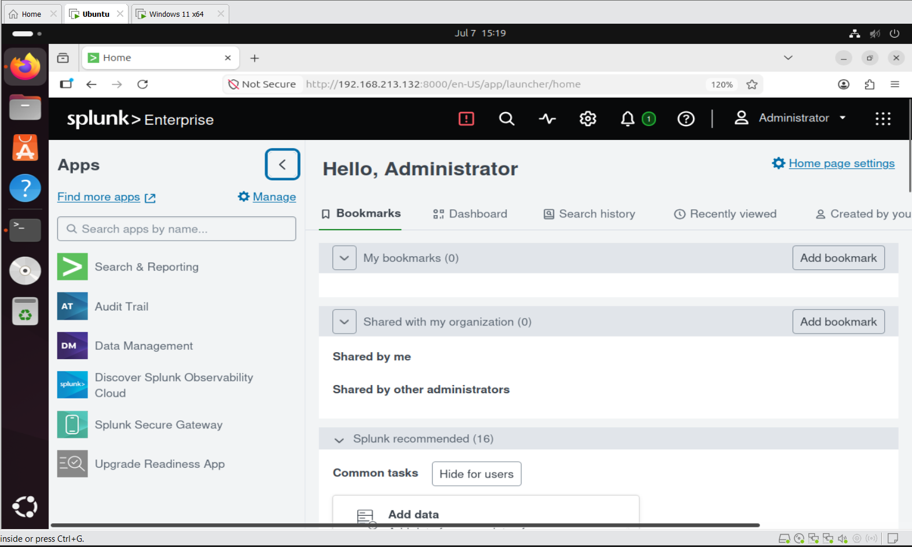
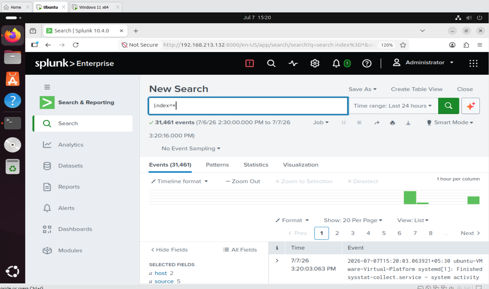
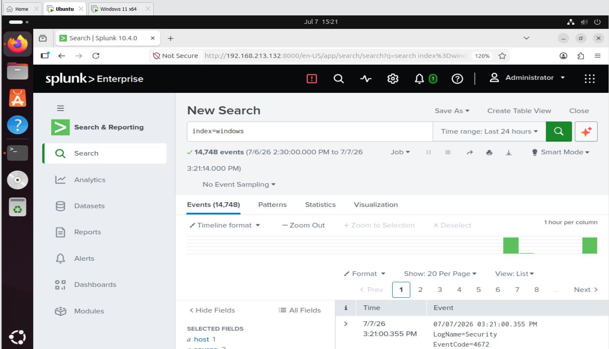
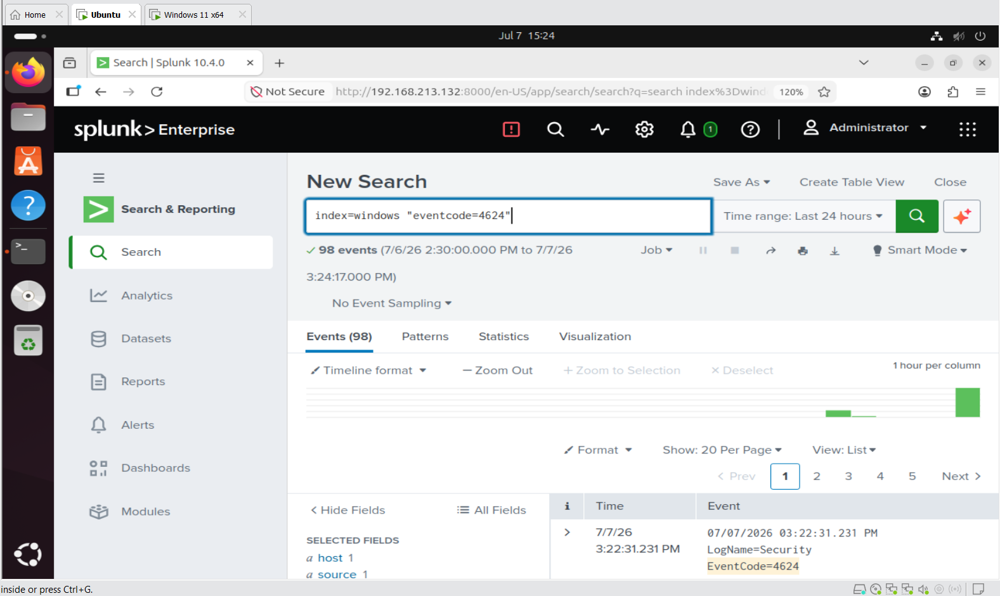
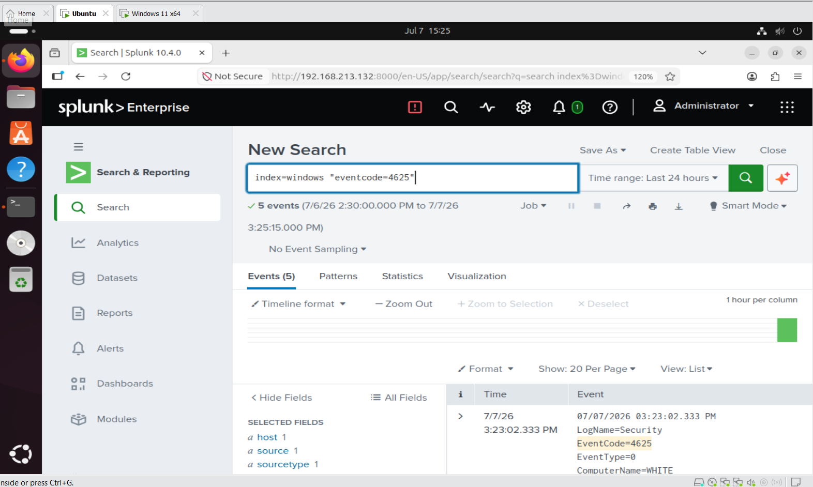
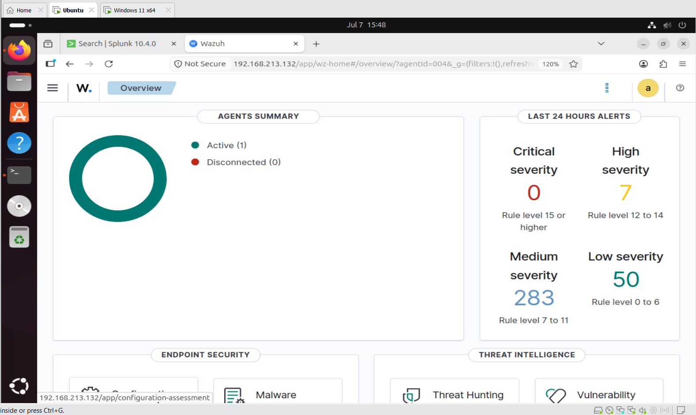
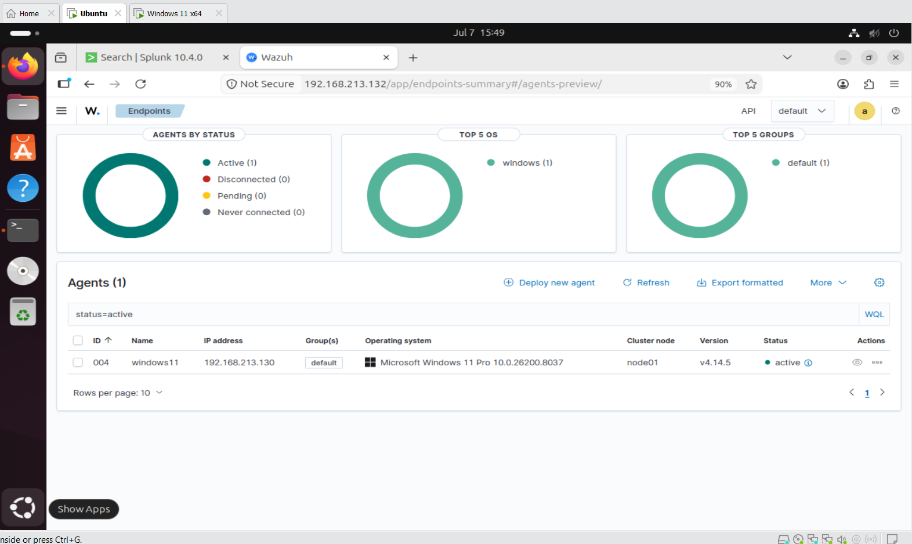
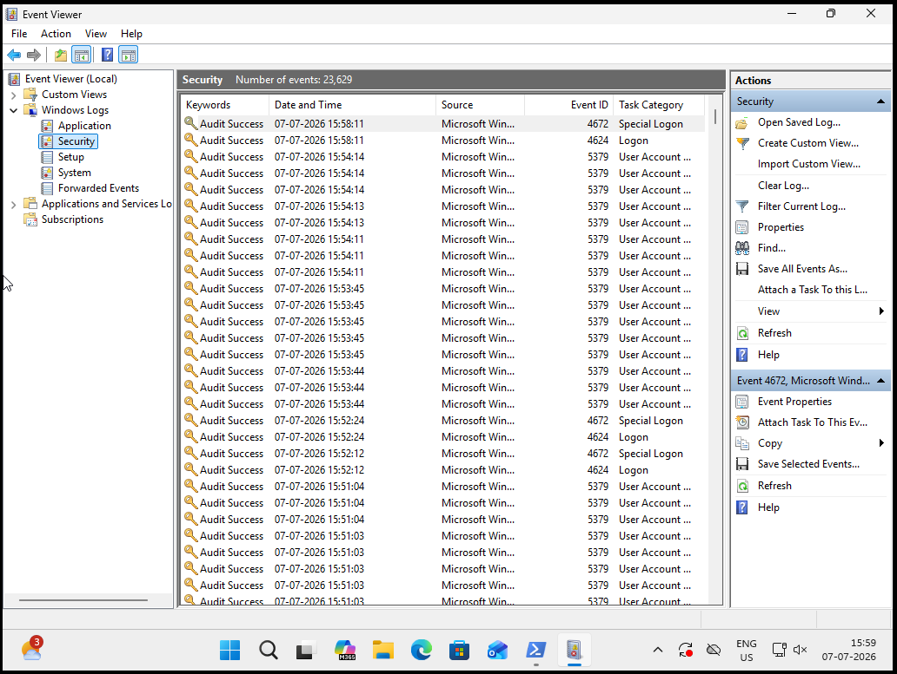
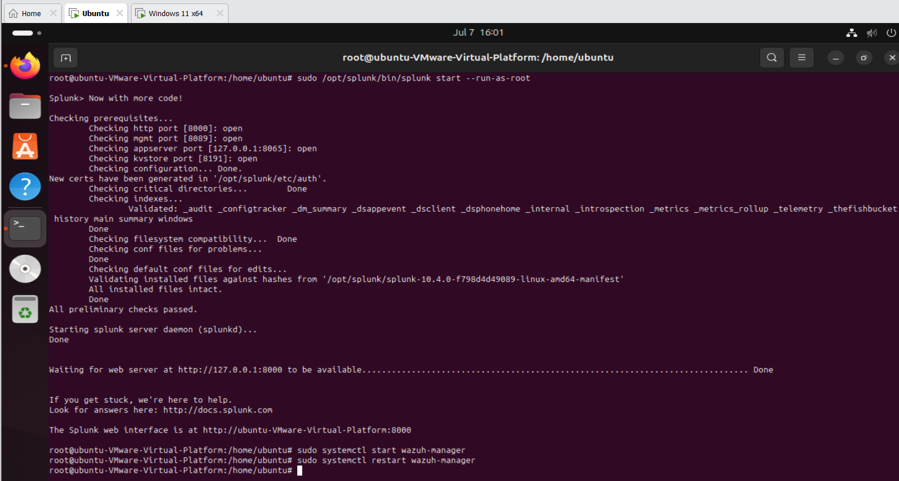

# 🛡️ Splunk-Wazuh Home Lab

A Security Operations Center (SOC) Home Lab demonstrating log collection, monitoring, and threat detection using **Splunk Enterprise Security** and **Wazuh**.

---

## 📖 Project Overview

This project demonstrates how to build a SOC Home Lab using Splunk Enterprise Security and Wazuh on Ubuntu, with a Windows 11 endpoint.

The objective is to collect Windows Event Logs, monitor security events, investigate suspicious activities, and gain hands-on experience with enterprise SIEM technologies.

---

## 🎯 Objectives

- Build a SOC Home Lab
- Install Splunk Enterprise
- Install Splunk Enterprise Security
- Install Wazuh
- Configure Windows 11 log collection
- Monitor security events
- Perform threat detection
- Learn SOC investigation workflow

---

## 🏗️ Lab Architecture

> Architecture diagram will be added here.

```
               Windows 11
        +-------------------------+
        | Wazuh Agent             |
        | Splunk Universal        |
        | Forwarder               |
        +------------+------------+
                     |
        +------------+------------+
        |                         |
+-------v--------+        +--------v--------+
| Wazuh Manager  |        | Splunk ES       |
| Ubuntu 22.04   |        | Ubuntu 22.04    |
+----------------+        +-----------------+
```

---

## 💻 Lab Environment

| Component | Technology |
|----------|------------|
| Operating System | Ubuntu 22.04 LTS |
| Endpoint | Windows 11 |
| SIEM | Splunk Enterprise |
| Security Platform | Splunk Enterprise Security |
| XDR | Wazuh |
| Log Forwarder | Splunk Universal Forwarder |
| Endpoint Agent | Wazuh Agent |
| Virtualization | VMware Workstation |

---

## 🔄 Log Flow

```
Windows 11
     │
     ├──────────────► Splunk Universal Forwarder
     │                       │
     │                       ▼
     │                Splunk Enterprise
     │
     └──────────────► Wazuh Agent
                             │
                             ▼
                      Wazuh Manager
```

---

## ✨ Features

- Windows Event Log Collection
- Security Event Monitoring
- Threat Detection
- Log Analysis
- Security Investigation
- SPL Queries
- Wazuh Alerts
- Dashboard Visualization

---

## 📁 Repository Structure

```
Splunk-Wazuh-HomeLab/
│
├── docs/
├── screenshots/
├── diagrams/
├── configs/
├── queries/
└── README.md
```

---

## 📚 Documentation

| Document | Description |
|----------|-------------|
| Lab Architecture | Overall architecture of the lab |
| Splunk Installation | Installing Splunk Enterprise & ES |
| Wazuh Installation | Installing Wazuh Manager |
| Windows Agent Setup | Configuring Wazuh Agent |
| Universal Forwarder | Splunk Forwarder setup |
| Log Collection | Collecting Windows Event Logs |
| Detection Use Cases | Security investigations |
| Troubleshooting | Common issues and fixes |

---

## 📸 Screenshots

Screenshots will be added for:

- Splunk Enterprise Dashboard
- Splunk Enterprise Security Dashboard

   
   
   
   
   
  
- Wazuh Dashboard
   
   
- Windows Event Viewer
   
   
---

## 🔍 Detection Use Cases

- Failed Login Detection (Event ID 4625)
- Successful Login Detection (Event ID 4624)
- PowerShell Activity
- Process Creation (Event ID 4688)
- User Account Creation
- USB Device Detection
- RDP Login Monitoring

---

## 🚀 Future Improvements

- Active Directory Integration
- Sysmon Integration
- Sigma Rules
- MITRE ATT&CK Mapping
- Email Alerts
- Custom Dashboards

---

## 👨‍💻 Author

**Koyya Naga Durga Prasad**

Aspiring SOC Analyst | Cybersecurity Enthusiast

---

⭐ If you found this project helpful, consider giving it a star!
